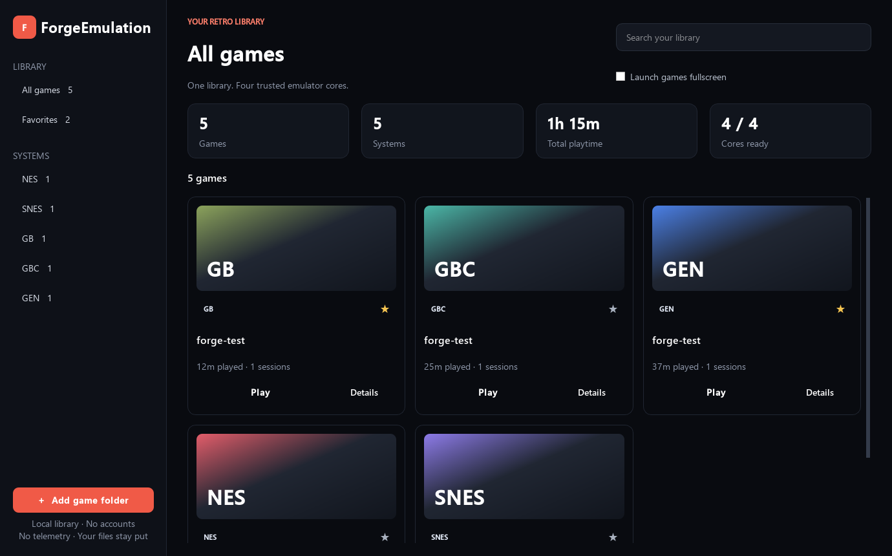
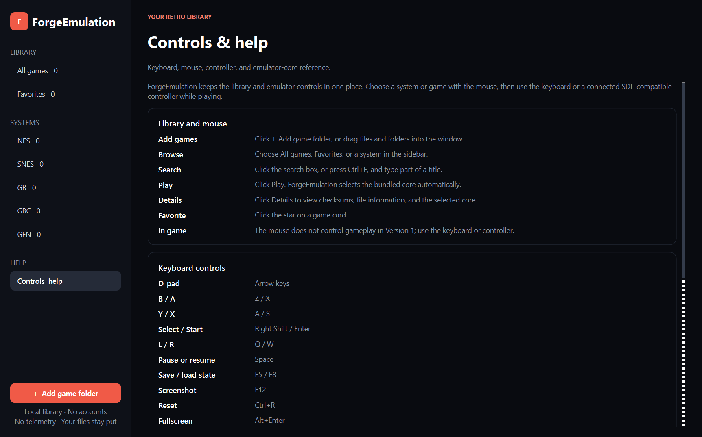

# ForgeEmulation

ForgeEmulation is a local-first Windows desktop library for legally obtained retro games. It scans folders without moving your files, identifies supported cartridges, and launches each game through a pinned, open-source libretro core in an isolated runtime process.

## Public Version 1.2

- Nintendo Entertainment System through Nestopia
- Super Nintendo Entertainment System through bsnes
- Game Boy and Game Boy Color through SameBoy
- Sega Genesis / Mega Drive through BlastEm
- Game Boy Advance through mGBA
- Sega Master System and Game Gear through SMS Plus GX
- Atari 2600 through Stella 2014
- Recursive folder scanning and ZIP inspection
- Search, system filters, favorites, Continue Playing, playtime, and session counts
- Keyboard input plus persistent remapping and library navigation for SDL controllers
- Native save RAM, nine save-state slots, screenshots, pause, reset, and fullscreen
- Global and per-game display/audio settings, local backup/restore, diagnostics, titles, and artwork
- No accounts, telemetry, metadata services, or ROM downloads

## Quick start

1. Download and extract the Windows x64 release.
2. Run `ForgeEmulation.exe`.
3. Select **Add game folder** and choose a folder containing games you lawfully possess.
4. Select **Play** on a library card.

Select a system in the sidebar to see the exact bundled emulator core, version,
license, and installation status. Select **Controls & help** or press **F1** for
the complete keyboard, mouse, controller, and core reference inside the app.

ForgeEmulation links to the selected files. It does not rename, move, modify, upload, or distribute them. ZIP members are extracted only into the local application cache when launched.

## Controls

| Action | Keyboard |
|---|---|
| D-pad | Arrow keys |
| B / A | Z / X |
| Y / X | A / S |
| Select / Start | Right Shift / Enter |
| L / R | Q / W |
| Quick menu | Escape or Tab |
| Pause | Space |
| Save state | F5 |
| Load state | F8 |
| Screenshot | F12 |
| Reset | Ctrl+R |
| Fullscreen | Alt+Enter |
| Exit game | Quick menu → Exit game |

Controller buttons use SDL's reported button order; common Xbox-compatible controllers work without configuration.
The mouse operates the library interface but is not mapped to gameplay.

## Controller and library navigation

- Controller settings create an automatic local profile for each connected controller.
- Every gameplay button and D-pad direction can be remapped without changing keyboard controls.
- The library can be navigated with the D-pad or left stick, selected with the configured library
  select button, and backed out of filters or search with the configured library back button.

The in-game quick menu provides state-slot selection, save/load, screenshots, reset,
scaling, filtering, volume, mute, fullscreen, and a deliberate exit action. Backups
include local library data, settings, profiles, saves, states, screenshots, and custom
artwork, but never ROM files.

## Supported files

ForgeEmulation recognizes `.nes`, `.unf`, `.unif`, `.sfc`, `.smc`, `.gb`, `.gbc`,
`.md`, `.gen`, header-verified Genesis `.bin`, `.gba`, `.sms`, `.gg`, and `.a26`
files. It inspects supported files inside ordinary ZIP archives. Multi-file disc
systems and nested archives remain out of scope.

## Legal and privacy

No commercial games, firmware, keys, cover art, or metadata are supplied. Users are responsible for complying with the law where they live. The application does not connect to an online service during normal use.

The frontend is licensed under GPL-2.0-or-later. Bundled cores retain their own licenses. See [THIRD_PARTY_LICENSES.md](THIRD_PARTY_LICENSES.md), [CORE_LICENSE_MATRIX.md](CORE_LICENSE_MATRIX.md), and `third_party/core-manifest.json` for exact versions, hashes, source snapshots, notices, and public-release verification status.

## Development

See [BUILDING.md](BUILDING.md), [TESTING.md](TESTING.md), and [ARCHITECTURE.md](ARCHITECTURE.md). This release is intentionally bounded; it does not include online metadata, a core updater, cloud sync, netplay, shader management, or a managed ROM store.

## Project status

Version 1.2 is a complete, bounded Windows release. Bug reports and focused pull
requests are welcome; broader feature work is considered only in a separately
reviewed release.

ForgeEmulation is part of the [Logan Pendragon Forge open-source collection](https://www.loganpendragonforge.com/open-source/).
